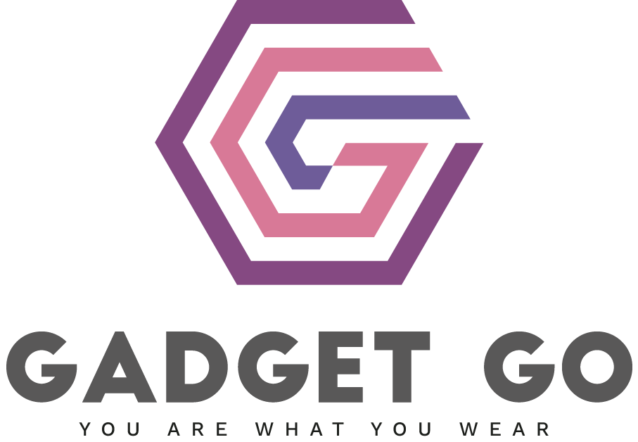

<!-- PROJECT LOGO -->
<br />
<div align="center">
  <a href="https://github.com/chaofan-w/gadget-go-online-store">
    
  </a>

  <h3 align="center">  
  an e-commerce website for electronic wearable products.
  </h3>

  <p align="center">
    <br />
    <a href="https://github.com/chaofan-w/gadget-go-online-store/blob/master/frontend/README.md"><strong>Explore the docs »</strong></a>
    <br />
    <br />
    <a href="https://gadget-go-go.netlify.app/" style="font-weight:800">View Demo Site</a>
    ·
    <a href="https://github.com/chaofan-w/gadget-go-online-store/issues">Report Bug</a>
    ·
    <a href="https://github.com/chaofan-w/gadget-go-online-store/issues">Request Feature</a>
  </p>
</div>

<!-- TABLE OF CONTENTS -->
<details>
  <summary>Table of Contents</summary>
  <ol>
    <li>
      <a href="#about-the-project">About The Project</a>
      <ul>
        <li><a href="#built-with">Built With</a></li>
        <li><a href="#data-structure">Data Structure</a></li>
      </ul>
    </li>
    <li>
      <a href="#getting-started">Getting Started</a>
      <ul>
        <li><a href="#prerequisites">Prerequisites</a></li>
        <li><a href="#installation">Installation</a></li>
      </ul>
    </li>
    <li><a href="#contributing">Contributing</a></li>
    <li><a href="#license">License</a></li>
    <li><a href="#contact">Contact</a></li>
  </ol>
</details>

<!-- ABOUT THE PROJECT -->

## About The Project

[![Product Name Screen Shot][product-screenshot]](https://gadget-go-go.netlify.app)

Gadget-go is an open-source e-commerce website that allows users to browse, search, select products, and make purchases, rating products and leave comments. It is built using the MERN stack (MongoDB, Express, React, Node.js) and Redux for state management, and Material-UI for styling.

Features:

- top product search bar with automatic suggestions
- filters: by categories, body locations, companies
- product ratings and comments editing, changing, deleting
- carts page:
  - adding/deleting products
  - using promotion code
  - auto calculating total price and tax
- checkout process:
  - cart review
  - shipping address form
  - payment info form
  - order reivew and confirmation
- historical order review
  - rating/commenting product bought
  - filter full order list by date/quantity/discount/total price/status

<p align="right">(<a href="#about-the-project">back to top</a>)</p>

### Built With

- [![JavaScript][javascript.js]][javascript-url]
- [![MongoDB][mongodb.js]][mongodb-url]
- [![ExpressJS][express.js]][express-url]
- [![React][react.js]][react-url]
- [![NodeJS][node.js]][node-url]
- [![Redux][redux.js]][redux-url]
- [![MaterialUI][materialui.js]][materialui-url]
- [![netlify][netlify.js]][netlify-url]
- [![heroku][heroku.js]][heroku-url]

<p align="right">(<a href="#about-the-project">back to top</a>)</p>

### Data Structure

- carts:

```sh
{
"_id": "63fdcfe69a59c04937130e34",
"customerId": "63f513109c55023b48edaecc",
"products": [
{
"productId": "7035",
"price": 79.99,
"quantity": 5
},
{
"productId": "6678",
"price": 49.47,
"quantity": 4
}
]
},
```

- customers

```sh
"_id": "63f513109c55023b48edaec9",
"firstName": "John",
"lastName": "Smith",
"email": "eharvey0@theglobeandmail.com",
"address": "79 Hansons Circle",
"city": "Roanoke",
"state": "Virginia",
"country": "United States",
"postcode": "24014",
"phone": "540-577-4899",
"password": "ddd"
```

- orders

```sh
{
"_id": "63f57f7398165d2b71d6f343",
"customerId": "63f513109c55023b48edaef5",
"date": "2023-01-30T23:53:35.504Z",
"status": "pending",
"products": [
{
"productId": "6881",
"quantity": 5
}
]
},
```

- products

```sh
{
"_id": "7035",
"category": 3,
"name": "Smartwatch G2 MTSWG2WL",
"price": 79.99,
"body_location": 1,
"imageSrc": "",
"numInStock": 0,
"companyId": "14897",
"arrivalDate": "2023-01-15T21:43:52.698Z",
"promotionPrice": null
}
```

- reviews

```sh
{
"_id": "63f5b2cdf07ffa2126f28855",
"customerId": "63f513109c55023b48edaef5",
"date": "2023-02-13T15:45:07.827Z",
"rating": 2,
"productId": "6545",
"text": "The strap on this smart bracelet broke after only a few weeks of use. I was really disappointed with the quality."
},
```

- categories
- body_locations
- companies

```sh
{
"_id": "19962",
"name": "Barska",
"url": "http://www.barska.com/",
"country": "United States"
},
```

<!-- GETTING STARTED -->

## Getting Started

This is an example of how you may give instructions on setting up your project locally.
To get a local copy up and running follow these simple example steps.

### Prerequisites

- npm
  ```sh
  npm install npm@latest -g
  ```
  or
- yarn

  ```sh
  npm install yarn@latest -g

  ```

### Installation

To install this application, please follow these steps:

1. Clone the repo
   ```sh
   git clone https://github.com/chaofan-w/gadget-go-online-store.git
   ```
2. Install packages

   ```sh
   npm install
   ```

   or

   ```sh
   yarn install
   ```

3. Create a .env file in the root directory of the project and add the required environment variables. These should include your MongoDB connection string and any other secret keys that your app uses.
   ```sh
   MONGO_URI=mongodb+srv://<username>:<password>@<cluster>.mongodb.net/<database>?retryWrites=true&w=majority
   ```

<p align="right">(<a href="#about-the-project">back to top</a>)</p>

<!-- CONTRIBUTING -->

## Contributing

Contributions are what make the open source community such an amazing place to learn, inspire, and create. Any contributions you make are **greatly appreciated**.

If you have a suggestion that would make this better, please fork the repo and create a pull request. You can also simply open an issue with the tag "enhancement".
Don't forget to give the project a star! Thanks again!

1. Fork the Project
2. Create your Feature Branch (`git checkout -b feature/AmazingFeature`)
3. Commit your Changes (`git commit -m 'Add some AmazingFeature'`)
4. Push to the Branch (`git push origin feature/AmazingFeature`)
5. Open a Pull Request

<p align="right">(<a href="#about-the-project">back to top</a>)</p>

<!-- LICENSE -->

## License

Distributed under the MIT License. See `LICENSE.txt` for more information.

<p align="right">(<a href="#about-the-project">back to top</a>)</p>

<!-- CONTACT -->

## Contact

Chaofan Wu
</br> ![gmail-shield] chaofan.w@gmail.com
</br> [![linkedin-shield]][linkedin-url]
</br> My Portfolio Site: www.chaofanwu.com

Project Link: [https://github.com/chaofan-w/gadget-go-online-store](https://github.com/chaofan-w/gadget-go-online-store)

liveDemo Link: https://gadget-go-go.netlify.app/

<p align="right">(<a href="#about-the-project">back to top</a>)</p>

[linkedin-shield]: https://img.shields.io/badge/-LinkedIn-black.svg?style=for-the-badge&logo=linkedin&colorB=555
[linkedin-url]: https://www.linkedin.com/in/chaofanwu/
[product-screenshot]: ./frontend/src/assets/listingPage.png
[mongodb.js]: https://img.shields.io/badge/MongoDB-4EA94B?style=for-the-badge&logo=mongodb&logoColor=white
[mongodb-url]: https://www.mongodb.com/
[react.js]: https://img.shields.io/badge/React-20232A?style=for-the-badge&logo=react&logoColor=61DAFB
[react-url]: https://reactjs.org/
[heroku.js]: https://img.shields.io/badge/Heroku-430098?style=for-the-badge&logo=heroku&logoColor=white
[heroku-url]: https://www.heroku.com/
[netlify.js]: https://img.shields.io/badge/Netlify-00C7B7?style=for-the-badge&logo=netlify&logoColor=white
[netlify-url]: https://www.netlify.com/
[redux.js]: https://img.shields.io/badge/Redux-593D88?style=for-the-badge&logo=redux&logoColor=white
[redux-url]: https://redux.js.org/
[express.js]: https://img.shields.io/badge/Express.js-404D59?style=for-the-badge
[express-url]: https://expressjs.com/
[node.js]: https://img.shields.io/badge/Node.js-43853D?style=for-the-badge&logo=node.js&logoColor=white
[node-url]: https://nodejs.dev/en/
[javascript.js]: https://img.shields.io/badge/JavaScript-F7DF1E?style=for-the-badge&logo=javascript&logoColor=black
[javascript-url]: https://www.javascript.com/
[materialui.js]: https://img.shields.io/badge/Material--UI-0081CB?style=for-the-badge&logo=material-ui&logoColor=white
[materialui-url]: https://mui.com/
[gmail-shield]: https://img.shields.io/badge/Gmail-D14836?style=for-the-badge&logo=gmail&logoColor=white
[gmail-address]: chaofan.w@gmail.com
